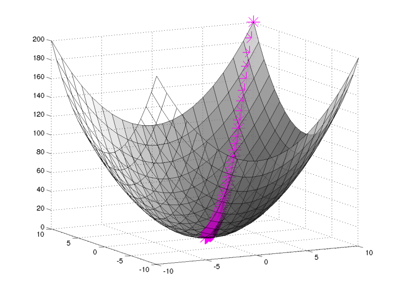
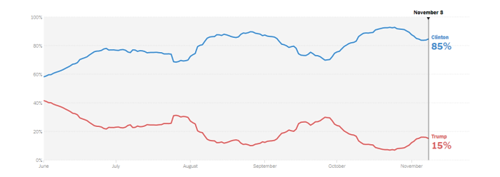

 

Machine Learning (DevConf 2017)

---

# Agenda

1. F# (demo)
2. Azure ML (demo)
3. Python (Booking.com)

---

## Problem

Simple Linear Regression

y = a*x + b

---

## Approaches
 1. Linear least squares
 2. Gradient decent

---

## Linear least squares
Mean: X' = 3, Y' = 4

| X| Y| X-X'|Y-Y'|(X - X')2 |(X-X')*(Y-Y')|
|--|--| ----|----| --------|-------------------------|
| 1| 2| -2  |-2  |  4      | 4                       |
| 2| 4| -1  | 0  |  1      | 0                       |
| 3| 5|  0  | 1  |  0      | 0                       |
| 4| 4|  1  | 0  |  1      | 0                       |
| 5| 5|  2  | 1  |  4      | 2                       |

---
## Linear least squares

a = 0.6  
b = 4 - 0.6*3 = 1.6

---

## Gradient decent

---

## Azure ML
[AzureML](https://studio.azureml.net/Home/)

---

## Python
Booking.com 

* Keras (library) (GPU and CPU)
* Tenserflow (library)
---
## Python 

* CNN (Convolutional Neural Network)

CNNs do take a biological inspiration from the visual cortex
For example, some neurons fired when exposed to vertical edges and some when shown horizontal or diagonal edges.
---

---

32X32X3 Image

3 for RGB

5X5X3 - Filter

28x28 - Array

Another filter 
28x28x2

---

---

## Predictions

---
##
Forecast demo
